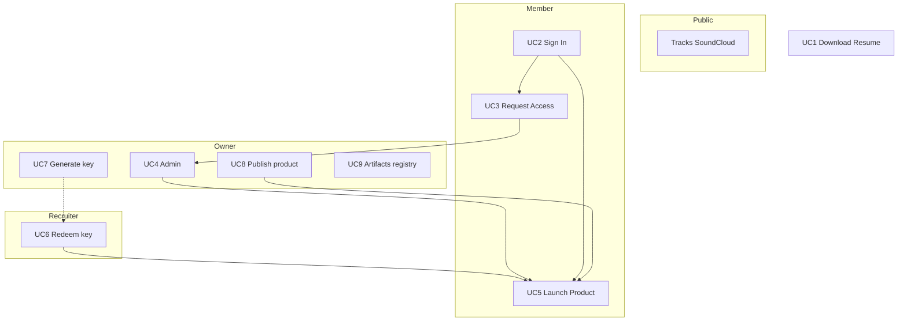

# Portfolio

**Alander Brand and Product Portfolio** — public site at [alander.io](https://alander.io). Presents bio, product links, tracks, artifacts, and owner dev tools. Serves as the Gestalt hub for sign-in and product launch (Deviante, Milebrick). **Gestalt v1.0.**

- **Site:** [portfolio](https://github.com/aland3r/portfolio) → `../`
- **Deploy:** GitHub Pages (apex `alander.io`)
- **Scope:** [[scope]]
- **Progress:** [[roadmap]] · live `content/roadmap.json`

## Actors & access levels

| Level | When |
|-------|------|
| **Visitor** | Public pages — CV, bio, tracks, artifacts, products hub |
| **Member** | Google account, limited — request access at blocked products (UC3) |
| **Recruiter** | Product demo via access key — no login (UC6) |
| **Owner** | Admin, keys, publish product, use cases panel |

## Use Case Diagram

## Use Case Index

| UC | Name | File | Status |
|----|------|------|--------|
| UC1 | Download resume | [[ABP-IO-UC1-DownloadResume]] | Documented · shipped |
| UC2 | Sign in | [[ABP-IO-UC2-SignIn]] | Documented · shipped |
| UC3 | Request access | [[ABP-IO-UC3-RequestAccess]] | Documented · planned |
| UC4 | Admin access | [[ABP-IO-UC4-AdminAccess]] | Documented · shipped |
| UC5 | Launch product | [[ABP-IO-UC5-LaunchProduct]] | Documented · partial |
| UC6 | Redeem access key | [[ABP-IO-UC6-RedeemAccessKey]] | Documented · planned |
| UC7 | Generate access key | [[ABP-IO-UC7-GenerateAccessKey]] | Documented · planned |
| UC8 | Publish product | [[ABP-IO-UC8-PublishProduct]] | Documented · planned |
| UC9 | Artifacts registry | [[ABP-IO-UC9-ArtifactsRegistry]] | Documented · exploratory |

## v1.0 Scope Notes

- **Products vs use cases:** `/products` = app hub; `/cases` = owner-only progress + launch (see scope).
- **Product hosts:** Deviante / Milebrick `live: false` until DNS + deploy.
- **Tracks:** Public SoundCloud page — not gated.
- **Docs:** This vault (`portfolio/docs/`) — not rendered as site pages unless linked from artifacts index.
